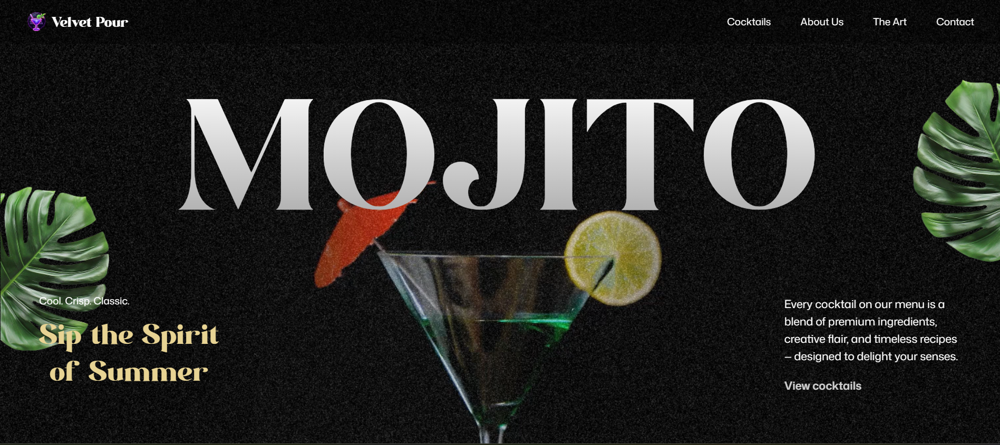
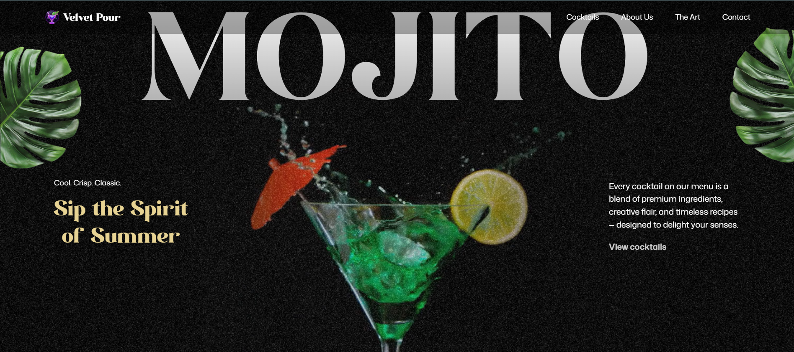

# 🍹 GSAP Cocktail Website

A fun animated cocktail website built using **React + Vite + GSAP+ Three.js**.

## 🚀 Live Demo
https://gsap-cocktail-henna.vercel.app/

## 🛠 Tech Stack
- React
- Vite
- GSAP
- JavaScript
- CSS
 

## ✨ Features
- Smooth animations
- Responsive design
- Modern UI

## 💻 Run Locally

Clone the repository:

git clone https://github.com/AdamyaMehta07/gsap_cocktail.git

Go into folder:

cd gsap_cocktail

Install dependencies:

npm install

Run the project:

npm run dev

Open in browser:

http://localhost:5173

## 📷 Preview

